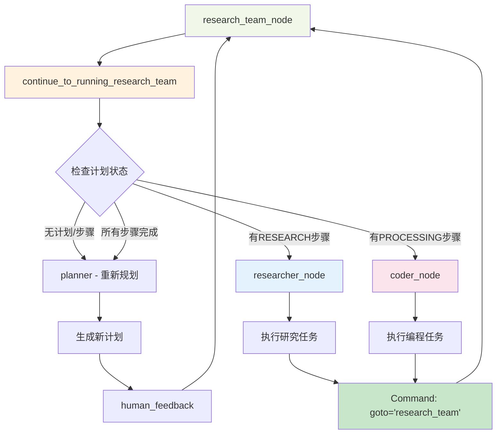
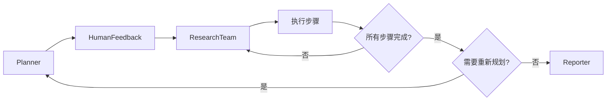
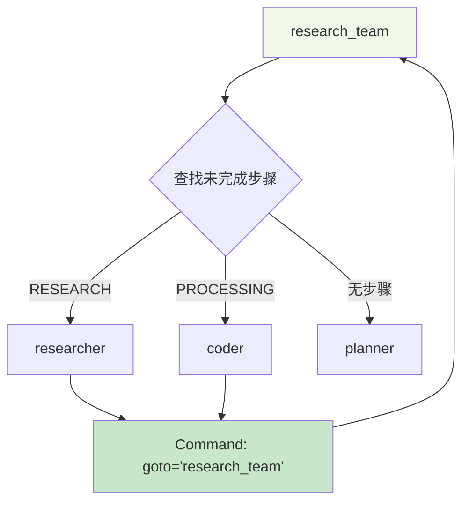
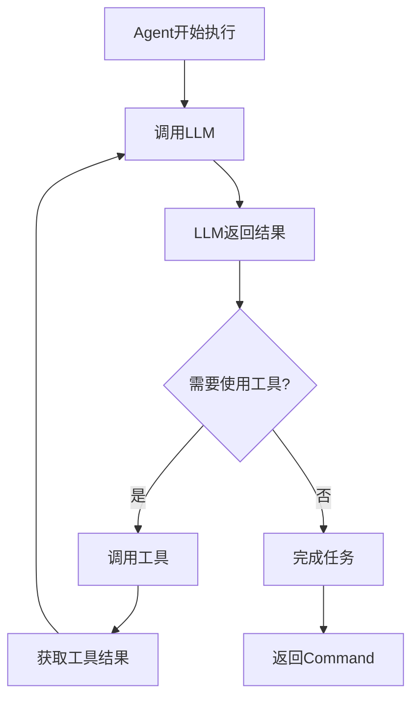

# DeerFlow Agent主Loop分析

## 🎯 核心问题

**DeerFlow的Agent主Loop在哪里？**

## 🔍 主Loop位置和机制

### 📍 **主Loop的核心：research_team ↔ researcher/coder循环**

DeerFlow的主要执行循环位于 **`research_team_node`** 和条件路由函数 **`continue_to_running_research_team`** 之间。

## 🔄 主Loop详细分析

### 1. 循环触发点

```python
# 在 builder.py 中定义的条件边
builder.add_conditional_edges(
    "research_team",                    # 🔑 循环的中心节点
    continue_to_running_research_team,  # 🔑 循环的决策函数
    ["planner", "researcher", "coder"], # 🔑 可能的下一步
)
```

### 2. 循环决策逻辑

```python
def continue_to_running_research_team(state: State):
    """🔑 这是主Loop的核心决策函数"""
    current_plan = state.get("current_plan")
    
    # 检查1: 没有计划 → 返回planner重新规划
    if not current_plan or not current_plan.steps:
        return "planner"
    
    # 检查2: 所有步骤完成 → 返回planner重新规划  
    if all(step.execution_res for step in current_plan.steps):
        return "planner"  # 🔄 触发重新规划循环
    
    # 检查3: 查找下一个未完成的步骤
    for step in current_plan.steps:
        if not step.execution_res:
            if step.step_type == StepType.RESEARCH:
                return "researcher"  # 🔄 继续执行循环
            elif step.step_type == StepType.PROCESSING:
                return "coder"       # 🔄 继续执行循环
                
    return "planner"  # 默认返回planner
```

### 3. 循环执行路径



## 🔄 多层循环结构

DeerFlow实际上有**三个层次的循环**：

### 1. **外层循环：计划-执行-报告循环**



**循环逻辑：**
```python
# 当所有步骤完成时
if all(step.execution_res for step in current_plan.steps):
    return "planner"  # 触发重新规划
```

### 2. **中层循环：步骤执行循环 (主Loop)**



**循环逻辑：**
```python
# researcher_node 和 coder_node 都返回
return Command(goto="research_team")  # 🔄 回到循环起点
```

### 3. **内层循环：Agent执行循环**



## 📋 主Loop的具体执行流程

### 第1轮循环：
```
1. research_team_node 被调用
2. continue_to_running_research_team 查找第一个未完成步骤
3. 假设是RESEARCH类型 → 返回 "researcher"
4. researcher_node 执行研究任务
5. researcher_node 返回 Command(goto="research_team")
6. 回到步骤1，开始第2轮循环
```

### 第2轮循环：
```
1. research_team_node 再次被调用
2. continue_to_running_research_team 查找下一个未完成步骤
3. 假设是PROCESSING类型 → 返回 "coder"  
4. coder_node 执行编程任务
5. coder_node 返回 Command(goto="research_team")
6. 回到步骤1，开始第3轮循环
```

### 循环结束：
```
1. research_team_node 再次被调用
2. continue_to_running_research_team 发现所有步骤完成
3. 返回 "planner" → 触发重新规划或结束
```

## 🔑 关键代码位置

### 1. 循环中心：research_team_node
```python
# 位置: src/graph/nodes.py:298
def research_team_node(state: State):
    """Research team node that collaborates on tasks."""
    logger.info("Research team is collaborating on tasks.")
    pass  # 实际上是空的，只是一个路由点
```

### 2. 循环决策：continue_to_running_research_team
```python
# 位置: src/graph/builder.py:21
def continue_to_running_research_team(state: State):
    # 这里是主Loop的决策逻辑
```

### 3. 循环返回：_execute_agent_step
```python
# 位置: src/graph/nodes.py:404
return Command(
    update={...},
    goto="research_team",  # 🔄 关键：总是返回research_team
)
```

## 🎯 为什么这样设计？

### 1. **统一调度中心**
- `research_team` 作为统一的任务调度中心
- 所有执行节点都返回到这里进行下一步决策

### 2. **灵活的步骤执行**
- 支持不同类型的步骤（RESEARCH, PROCESSING）
- 可以动态分配给不同的专门代理

### 3. **状态驱动**
- 基于 `execution_res` 字段判断步骤是否完成
- 自动跟踪执行进度

### 4. **容错和重试**
- 当所有步骤完成时，可以触发重新规划
- 支持多轮迭代改进

## 💡 总结

**DeerFlow的主Loop = research_team ↔ researcher/coder 循环**

- **循环中心**: `research_team_node`
- **循环决策**: `continue_to_running_research_team`
- **循环返回**: 所有执行节点都 `Command(goto="research_team")`
- **循环终止**: 所有步骤完成时返回 `"planner"`

这种设计实现了一个**状态驱动的任务执行引擎**，能够自动调度和执行复杂的多步骤研究计划！