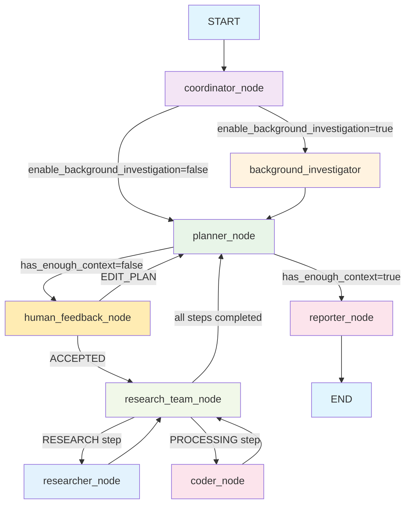
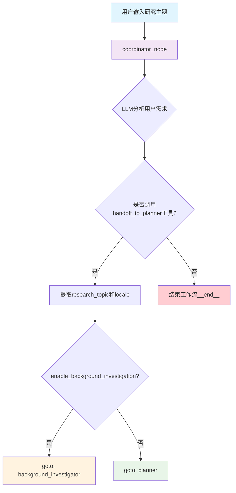
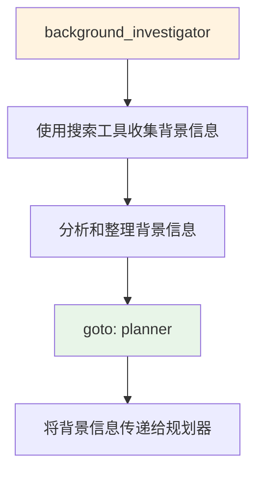
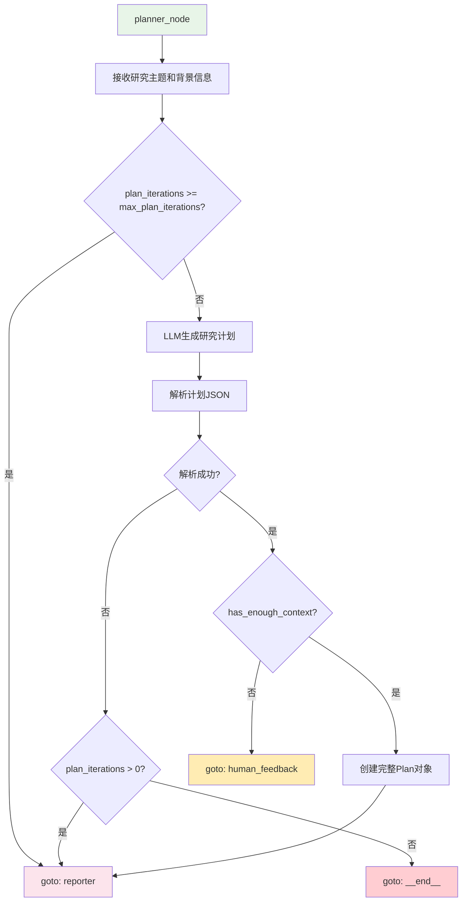
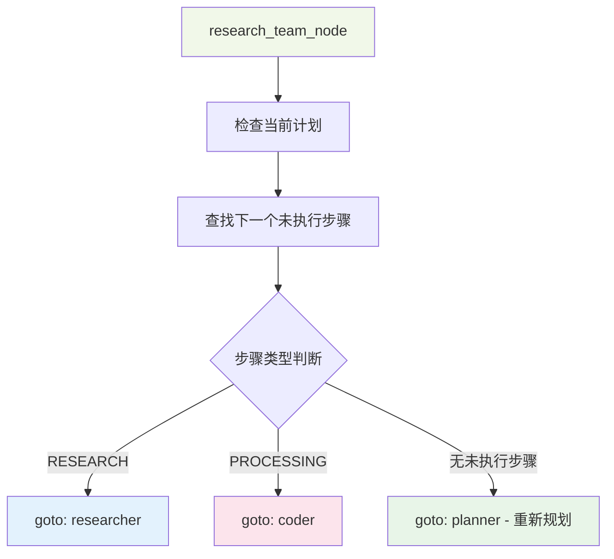
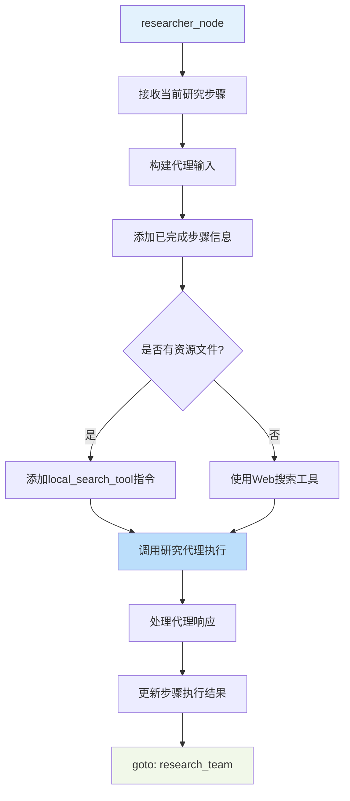
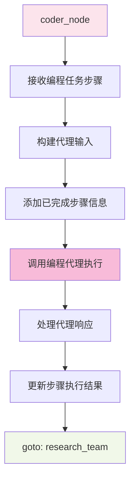
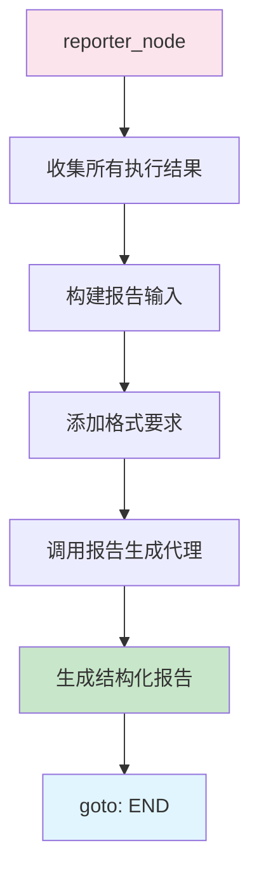

# DeerFlow 主流程图详解

## 🎯 整体流程概览



## 🔄 详细执行流程

### 1. 协调器阶段 (coordinator_node)



**核心功能：**
- 🎯 **分析用户输入**：理解用户的研究需求
- 🔧 **工具调用判断**：决定是否需要深度研究
- 🌍 **语言检测**：识别用户的语言环境
- 📋 **提取研究主题**：从用户输入中提取核心研究主题

### 2. 背景调查阶段 (background_investigator) [可选]



**核心功能：**
- 🔍 **Web搜索**：使用搜索引擎收集相关背景信息
- 📊 **信息整理**：分析和结构化背景调查结果
- 🔗 **信息传递**：为规划器提供更丰富的上下文

### 3. 规划阶段 (planner_node)



**核心功能：**
- 📋 **生成研究计划**：基于主题和背景信息制定详细计划
- 🔄 **迭代优化**：支持多轮计划改进
- ✅ **上下文判断**：决定是否有足够信息直接生成报告
- 📝 **步骤分解**：将研究任务分解为具体的执行步骤

### 4. 人工反馈阶段 (human_feedback_node)

```mermaid
flowchart TD
    A[human_feedback_node] --> B{auto_accepted_plan?}
    B -->|是| C[跳过用户交互]
    B -->|否| D[interrupt: 请审核计划]
    D --> E{用户反馈类型}
    E -->|[EDIT_PLAN]| F[goto: planner - 修改计划]
    E -->|[ACCEPTED]| G[继续执行]
    C --> G
    G --> H[解析计划JSON]
    H --> I{解析成功?}
    I -->|是| J[goto: research_team]
    I -->|否| K{plan_iterations > 1?}
    K -->|是| L[goto: reporter]
    K -->|否| M[goto: __end__]
    
    style A fill:#ffecb3
    style D fill:#ff9800
    style F fill:#e8f5e8
    style J fill:#f1f8e9
    style L fill:#fce4ec
    style M fill:#ffcdd2
```

**核心功能：**
- 👥 **用户交互**：允许用户审核和修改研究计划
- 🔄 **计划迭代**：支持用户要求修改计划
- ✅ **计划确认**：确保计划符合用户期望
- 🤖 **自动模式**：支持跳过人工审核的自动执行模式

### 5. 研究团队协调 (research_team_node)



**核心功能：**
- 📋 **任务调度**：根据计划步骤类型分配合适的代理
- 🔄 **进度跟踪**：监控计划执行进度
- 🎯 **智能路由**：将不同类型的任务分配给专门的代理

### 6. 研究员执行 (researcher_node)



**核心功能：**
- 🔍 **信息搜索**：使用多种工具搜索相关信息
- 📚 **资源利用**：优先使用用户提供的资源文件
- 📝 **结果整理**：结构化整理研究结果
- 🔗 **引用管理**：确保正确的引用格式

### 7. 编程员执行 (coder_node)



**核心功能：**
- 💻 **代码生成**：根据需求生成相关代码
- 🔧 **数据处理**：处理和分析数据
- 📊 **结果可视化**：创建图表和可视化内容
- 🧪 **实验验证**：运行实验和验证结果

### 8. 报告生成 (reporter_node)



**核心功能：**
- 📊 **结果汇总**：整合所有研究和处理结果
- 📝 **报告结构化**：按照标准格式生成报告
- 🔗 **引用整理**：统一管理所有引用和来源
- 📋 **表格优化**：优先使用表格展示数据

## 🔄 条件路由机制

### continue_to_running_research_team 函数

```python
def continue_to_running_research_team(state: State):
    current_plan = state.get("current_plan")
    
    # 检查是否有有效计划
    if not current_plan or not current_plan.steps:
        return "planner"
    
    # 检查是否所有步骤都已完成
    if all(step.execution_res for step in current_plan.steps):
        return "planner"  # 重新规划
    
    # 查找第一个未完成的步骤
    for step in current_plan.steps:
        if not step.execution_res:
            if step.step_type == StepType.RESEARCH:
                return "researcher"
            elif step.step_type == StepType.PROCESSING:
                return "coder"
            
    return "planner"
```

## 🎯 核心特性

### 1. **灵活的计划执行**
- 支持多种步骤类型（RESEARCH, PROCESSING）
- 动态路由到相应的专门代理
- 自动跟踪执行进度

### 2. **智能的上下文判断**
- 规划器可以判断是否有足够信息直接生成报告
- 支持迭代改进计划
- 人工审核和自动执行两种模式

### 3. **多代理协作**
- 协调器：用户交互和需求分析
- 背景调查员：信息收集和上下文增强
- 规划器：任务分解和计划制定
- 研究员：信息搜索和研究
- 编程员：代码生成和数据处理
- 报告员：结果整合和报告生成

### 4. **容错和迭代**
- 支持计划修改和重新执行
- 错误处理和回退机制
- 最大迭代次数限制防止无限循环

### 5. **资源集成**
- 支持用户上传的资源文件
- 多种搜索工具集成
- 本地搜索和Web搜索结合

这个流程图展示了DeerFlow作为一个智能研究助手的完整工作流程，从用户需求分析到最终报告生成的全过程。