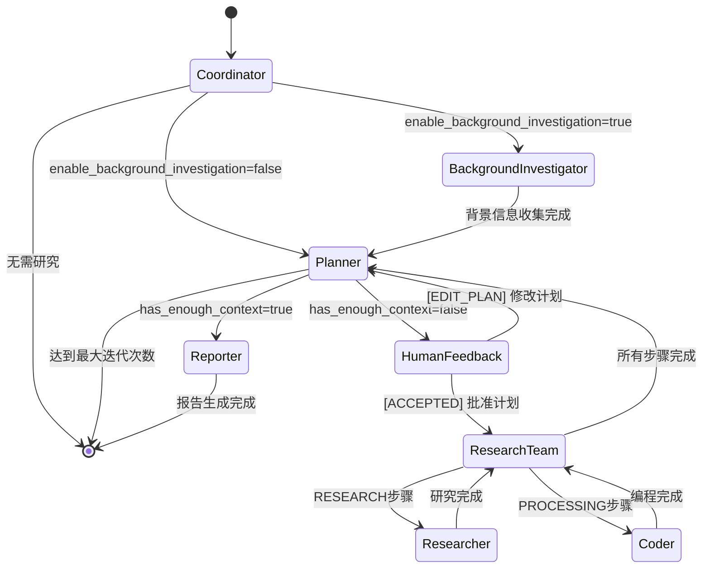
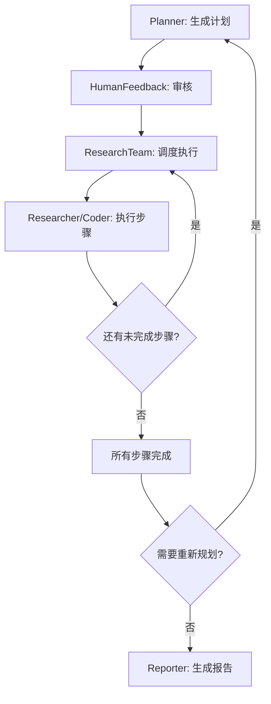
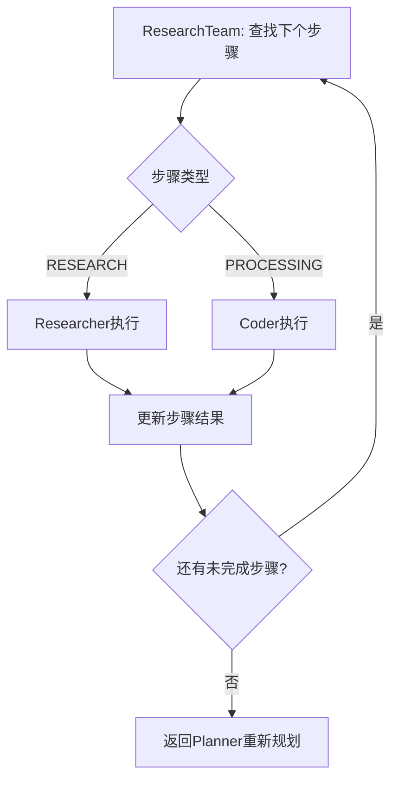

# DeerFlow 简化主流程图

## 🎯 核心流程 (主要路径)

```mermaid
graph LR
    A[用户输入] --> B[协调器]
    B --> C[背景调查]
    C --> D[规划器]
    D --> E[人工审核]
    E --> F[研究团队]
    F --> G[研究员/编程员]
    G --> H[循环执行]
    H --> I[报告生成]
    I --> J[结束]

    style A fill:#e3f2fd
    style B fill:#f3e5f5
    style C fill:#fff3e0
    style D fill:#e8f5e8
    style E fill:#ffecb3
    style F fill:#f1f8e9
    style G fill:#e3f2fd
    style H fill:#f1f8e9
    style I fill:#fce4ec
    style J fill:#e1f5fe
```



## 🔄 详细状态转换图



## 📋 节点功能总结

| 节点 | 主要功能 | 输入 | 输出 | 下一步 |
|------|----------|------|------|--------|
| **Coordinator** | 用户需求分析 | 用户消息 | 研究主题、语言 | Planner/BackgroundInvestigator |
| **BackgroundInvestigator** | 背景信息收集 | 研究主题 | 背景信息 | Planner |
| **Planner** | 生成研究计划 | 主题+背景 | 结构化计划 | HumanFeedback/Reporter |
| **HumanFeedback** | 计划审核 | 计划草案 | 用户反馈 | Planner/ResearchTeam |
| **ResearchTeam** | 任务调度 | 执行计划 | 下个任务 | Researcher/Coder/Planner |
| **Researcher** | 信息研究 | 研究任务 | 研究结果 | ResearchTeam |
| **Coder** | 代码处理 | 编程任务 | 代码结果 | ResearchTeam |
| **Reporter** | 报告生成 | 所有结果 | 最终报告 | END |

## 🔑 关键决策点

### 1. 协调器决策
```
用户输入 → LLM分析 → 是否调用handoff_to_planner?
├─ 是 → 提取主题和语言 → 继续流程
└─ 否 → 直接结束
```

### 2. 规划器决策
```
生成计划 → 解析JSON → has_enough_context?
├─ 是 → 直接生成报告
└─ 否 → 人工审核
```

### 3. 人工反馈决策
```
用户审核 → 反馈类型判断
├─ [EDIT_PLAN] → 返回规划器修改
└─ [ACCEPTED] → 进入执行阶段
```

### 4. 研究团队决策
```
检查计划 → 查找未完成步骤 → 步骤类型?
├─ RESEARCH → 分配给研究员
├─ PROCESSING → 分配给编程员
└─ 无步骤 → 返回规划器
```

## 🔄 核心循环

### 计划-执行-报告循环


### 步骤执行循环


## 🎯 DeerFlow的核心优势

1. **🤖 智能协调**: 自动理解用户需求并提取关键信息
2. **📋 灵活规划**: 支持迭代改进和人工审核的计划系统
3. **🔄 动态执行**: 根据步骤类型智能分配专门代理
4. **👥 多代理协作**: 研究员和编程员分工合作
5. **📊 自动报告**: 智能整合所有结果生成结构化报告
6. **🔁 容错循环**: 支持重新规划和错误恢复
7. **📚 资源集成**: 支持本地文件和Web搜索的混合使用

这个流程展示了DeerFlow作为一个完整的AI研究助手系统，如何通过多个专门的代理协作来完成复杂的研究任务。