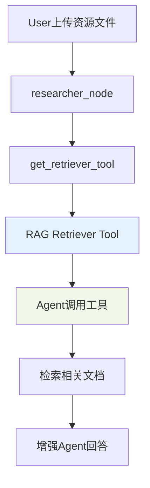
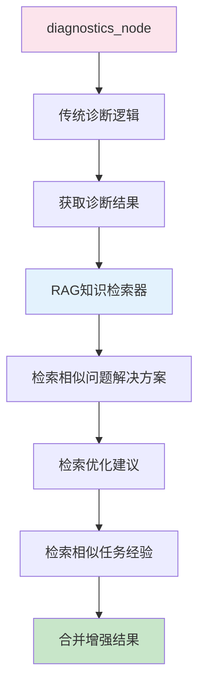
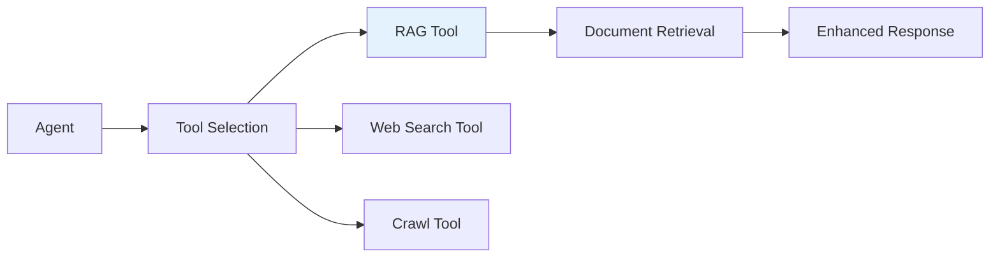
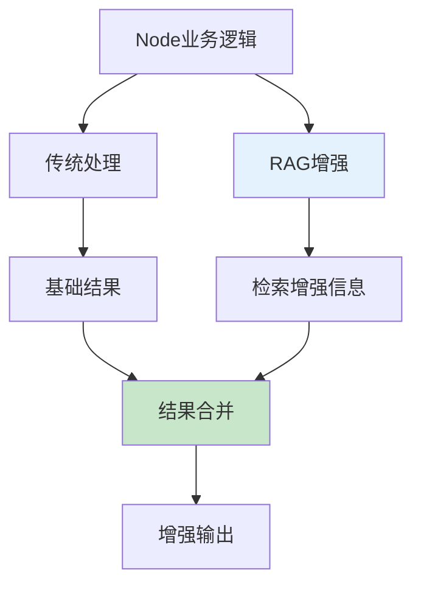

# RAG在哪个层面使用？

## 🎯 核心问题

**RAG (Retrieval Augmented Generation) 在哪个层面使用？**

根据代码分析，RAG在不同系统中有不同的使用层面：

## 🏗️ RAG使用层面对比

### 1. DeerFlow中的RAG使用

#### 📍 **使用层面: Tool层面 (工具级别)**



**代码位置和逻辑：**
```python
# src/graph/nodes.py:485
def researcher_node(state, config):
    tools = [get_web_search_tool(), crawl_tool]
    retriever_tool = get_retriever_tool(state.get("resources", []))  # 🔑 RAG作为工具
    if retriever_tool:
        tools.insert(0, retriever_tool)  # 优先使用RAG工具
    return await _setup_and_execute_agent_step(state, config, "researcher", tools)
```

**特点：**
- ✅ **工具化RAG**: RAG被封装为Agent的一个工具
- ✅ **用户资源优先**: 优先检索用户上传的文档
- ✅ **透明集成**: Agent自动决定何时使用RAG工具
- ✅ **文档检索**: 主要用于检索用户提供的资源文件

### 2. 训练任务研究Agent中的RAG使用

#### 📍 **使用层面: Node层面 (节点级别)**



**代码位置和逻辑：**
```python
# training_agent_project/src/graph/nodes.py:447
def diagnostics_node(state, config):
    # 1. 传统诊断
    diagnosis_result = diagnose_training_issues.invoke({...})
    
    # 2. RAG增强诊断
    knowledge_retriever = create_knowledge_retriever("historical")  # 🔑 创建RAG检索器
    
    if knowledge_retriever and diagnosis_result.get("issues_found"):
        for issue in diagnosis_result["issues_found"]:
            solutions = await knowledge_retriever.retrieve_solutions(problem_desc, top_k=2)  # 🔑 检索解决方案
            rag_solutions.extend(solution.solutions_applied)
    
    # 3. RAG增强优化建议
    rag_tips = await knowledge_retriever.retrieve_optimization_tips(rag_context, top_k=5)  # 🔑 检索优化建议
    similar_tasks = await knowledge_retriever.retrieve_similar_tasks(query_task, top_k=3)  # 🔑 检索相似任务
```

**特点：**
- ✅ **节点级集成**: RAG直接集成在特定节点的业务逻辑中
- ✅ **多维度检索**: 解决方案、优化建议、相似任务多角度检索
- ✅ **智能增强**: 基于传统分析结果进行RAG增强
- ✅ **历史经验**: 利用历史训练任务的经验和知识

## 📊 RAG使用层面对比

| 维度 | DeerFlow | 训练任务研究Agent |
|------|----------|-------------------|
| **使用层面** | 🔧 Tool层面 | 🏗️ Node层面 |
| **集成方式** | Agent工具调用 | 节点业务逻辑 |
| **数据源** | 用户上传文档 | 历史训练知识库 |
| **触发方式** | Agent自主决定 | 节点逻辑控制 |
| **使用场景** | 文档检索增强 | 诊断和建议增强 |
| **知识类型** | 用户特定资源 | 领域专业知识 |

## 🔍 详细层面分析

### 1. **Tool层面使用 (DeerFlow)**



**优势：**
- 🎯 **灵活性**: Agent可以根据需要选择是否使用RAG
- 🔄 **可组合**: 可以与其他工具组合使用
- 📚 **资源导向**: 专注于用户提供的特定资源

**代码实现：**
```python
# RAG作为工具被Agent调用
class RetrieverTool(BaseTool):
    def _run(self, keywords: str) -> list[Document]:
        return self.retriever.get_relevant_documents(keywords)
```

### 2. **Node层面使用 (训练任务研究Agent)**



**优势：**
- 🎯 **深度集成**: RAG逻辑与业务逻辑深度融合
- 🧠 **智能增强**: 基于上下文的智能检索
- 📈 **专业化**: 针对特定领域的知识增强

**代码实现：**
```python
# RAG直接集成在节点逻辑中
def diagnostics_node(state, config):
    # 传统分析
    traditional_result = traditional_analysis()
    
    # RAG增强
    knowledge_retriever = create_knowledge_retriever()
    rag_enhancement = await knowledge_retriever.retrieve_solutions()
    
    # 合并结果
    enhanced_result = merge_results(traditional_result, rag_enhancement)
```

## 🎯 不同层面的适用场景

### 1. **Tool层面适合的场景**
- 📄 **文档检索**: 用户上传的资源文件检索
- 🔍 **通用搜索**: 需要灵活的信息检索
- 🛠️ **工具化需求**: 希望RAG作为可选工具

### 2. **Node层面适合的场景**
- 🧠 **专业分析**: 需要领域专业知识增强
- 📊 **决策支持**: 基于历史经验的智能建议
- 🎯 **特定业务**: 与特定业务逻辑深度集成

## 🔧 RAG实现架构对比

### DeerFlow架构:
```
User Resources → RAG Provider → Retriever Tool → Agent → Enhanced Response
```

### 训练任务研究Agent架构:
```
Business Context → Knowledge Retriever → Vector/Historical DB → Enhanced Analysis
```

## 💡 总结

**RAG在不同层面的使用：**

1. **🔧 Tool层面 (DeerFlow)**:
   - RAG作为Agent的可选工具
   - 用于检索用户上传的资源文件
   - Agent自主决定何时使用

2. **🏗️ Node层面 (训练任务研究Agent)**:
   - RAG直接集成在节点业务逻辑中
   - 用于增强专业分析和决策
   - 基于上下文的智能检索

**选择原则：**
- **Tool层面**: 适合通用、灵活的文档检索场景
- **Node层面**: 适合专业、深度集成的业务增强场景

两种方式各有优势，选择哪种取决于具体的应用场景和集成需求！