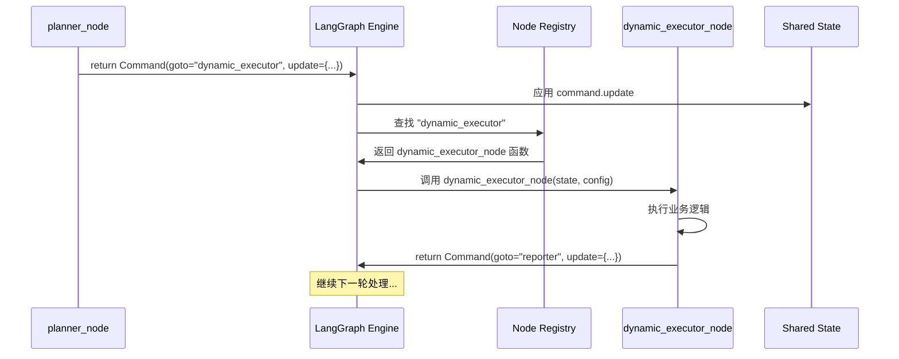

# LangGraph Command执行机制详解

## 🎯 核心问题

**Command如何知道拿到command后用什么来执行？**

## 🏗️ LangGraph内部机制

### 1. 节点注册映射表

在构建图时，LangGraph会建立一个**节点名称 → 节点函数**的映射表：

```python
def _build_base_graph():
    builder = StateGraph(TrainingAgentState)
    
    # 🔑 关键：这里建立了 节点名称 → 节点函数 的映射关系
    builder.add_node("coordinator", coordinator_node)        # "coordinator" → coordinator_node函数
    builder.add_node("planner", planner_node)                # "planner" → planner_node函数  
    builder.add_node("dynamic_executor", dynamic_executor_node)  # "dynamic_executor" → dynamic_executor_node函数
    builder.add_node("reporter", reporter_node)              # "reporter" → reporter_node函数
    
    return builder.compile()  # 编译后形成执行器
```

**内部映射表示例：**
```python
# LangGraph内部维护的映射表 (简化表示)
node_registry = {
    "coordinator": coordinator_node,
    "planner": planner_node, 
    "dynamic_executor": dynamic_executor_node,
    "reporter": reporter_node
}
```

### 2. Command解析和路由

当节点返回Command时，LangGraph会解析Command并找到对应的执行函数：

```python
# 某个节点返回Command
command = Command(goto="dynamic_executor", update={...})

# LangGraph内部处理流程 (伪代码)
def process_command(command, node_registry, current_state):
    # 1. 解析Command中的goto字段
    next_node_name = command.goto  # "dynamic_executor"
    
    # 2. 从注册表中查找对应的函数
    next_node_function = node_registry[next_node_name]  # dynamic_executor_node
    
    # 3. 应用状态更新
    current_state.update(command.update)
    
    # 4. 调用目标节点函数
    next_command = next_node_function(current_state, config)
    
    # 5. 如果还有下一步，继续处理
    if next_command.goto != "__end__":
        return process_command(next_command, node_registry, current_state)
```

## 🔄 具体执行示例

### 示例：从planner到dynamic_executor

```python
# 1. planner_node返回Command
def planner_node(state, config):
    plan = generate_plan()
    return Command(
        goto="dynamic_executor",    # 🎯 目标节点名称
        update={"current_plan": plan}
    )

# 2. LangGraph查找映射表
# node_registry["dynamic_executor"] = dynamic_executor_node

# 3. LangGraph调用目标函数
def dynamic_executor_node(state, config):  # 🔧 这个函数被调用
    current_plan = state.get("current_plan")  # 获取planner设置的计划
    # ... 执行逻辑
    return Command(goto="reporter", update={...})
```

## 📋 完整流程图



## 🔧 实际代码演示

让我创建一个简化的演示，展示这个机制：

```python
class SimplifiedLangGraph:
    """简化的LangGraph执行引擎演示"""
    
    def __init__(self):
        self.node_registry = {}  # 节点注册表
        self.state = {}         # 共享状态
    
    def add_node(self, name: str, function: callable):
        """注册节点函数"""
        self.node_registry[name] = function
        print(f"📝 注册节点: '{name}' → {function.__name__}")
    
    def execute_command(self, command):
        """执行Command"""
        print(f"\n🔧 执行Command: goto='{command.goto}'")
        
        # 1. 应用状态更新
        if hasattr(command, 'update') and command.update:
            self.state.update(command.update)
            print(f"📦 状态更新: {list(command.update.keys())}")
        
        # 2. 查找目标节点函数
        target_function = self.node_registry.get(command.goto)
        if not target_function:
            print(f"❌ 错误: 找不到节点 '{command.goto}'")
            return None
        
        print(f"🎯 找到目标函数: {target_function.__name__}")
        
        # 3. 调用目标函数
        try:
            next_command = target_function(self.state)
            print(f"✅ 函数执行完成")
            return next_command
        except Exception as e:
            print(f"❌ 函数执行失败: {e}")
            return None
    
    def run_workflow(self, start_command):
        """运行完整工作流"""
        print("🚀 开始执行工作流...")
        current_command = start_command
        step = 1
        
        while current_command and current_command.goto != "__end__":
            print(f"\n--- 步骤 {step} ---")
            current_command = self.execute_command(current_command)
            step += 1
            
            # 安全检查，避免无限循环
            if step > 10:
                print("⚠️ 达到最大步数限制")
                break
        
        print(f"\n🎉 工作流执行完成! 最终状态: {self.state}")

# 演示用的节点函数
def demo_planner(state):
    print("  📋 生成计划...")
    plan = {"steps": ["step1", "step2", "step3"]}
    return Command(goto="executor", update={"plan": plan})

def demo_executor(state):
    print("  🔧 执行计划...")
    plan = state.get("plan", {})
    executed_steps = state.get("executed_steps", 0) + 1
    
    if executed_steps < len(plan.get("steps", [])):
        return Command(goto="executor", update={"executed_steps": executed_steps})
    else:
        return Command(goto="reporter", update={"executed_steps": executed_steps})

def demo_reporter(state):
    print("  📊 生成报告...")
    report = f"执行了 {state.get('executed_steps', 0)} 个步骤"
    return Command(goto="__end__", update={"report": report})

# 简化的Command类
class Command:
    def __init__(self, goto, update=None):
        self.goto = goto
        self.update = update or {}

# 运行演示
if __name__ == "__main__":
    # 创建简化的执行引擎
    engine = SimplifiedLangGraph()
    
    # 注册节点 (这就是 add_node 做的事情)
    engine.add_node("planner", demo_planner)
    engine.add_node("executor", demo_executor) 
    engine.add_node("reporter", demo_reporter)
    
    # 开始执行
    start_command = Command(goto="planner")
    engine.run_workflow(start_command)
```

## 🔑 关键点总结

### 1. **节点注册机制**
```python
builder.add_node("节点名称", 节点函数)
# 在内部创建映射: "节点名称" → 节点函数
```

### 2. **Command路由机制** 
```python
Command(goto="节点名称", update={...})
# LangGraph根据goto字段查找对应的节点函数
```

### 3. **函数调用机制**
```python
target_function = node_registry[command.goto]
next_command = target_function(updated_state, config)
```

### 4. **状态传递机制**
```python
# 每次调用前先更新状态
state.update(command.update)
# 然后传递给目标函数
target_function(state, config)
```

## 🎯 回答您的问题

**Command如何知道用什么来执行？**

1. **注册阶段**: `builder.add_node("名称", 函数)` 建立映射
2. **解析阶段**: `Command(goto="名称")` 指定目标
3. **查找阶段**: LangGraph从映射表中找到对应函数
4. **执行阶段**: 调用找到的函数并传递状态

**核心机制 = 节点注册表 + Command路由 + 函数调用**

这就像一个"电话簿"系统：
- `add_node` = 在电话簿中记录 "姓名 → 电话号码"
- `Command(goto="姓名")` = 要打电话给某人
- LangGraph = 查电话簿找到号码并拨打

LangGraph通过这种机制实现了声明式的工作流编排，您只需要指定"去哪里"，系统会自动找到"怎么去"！