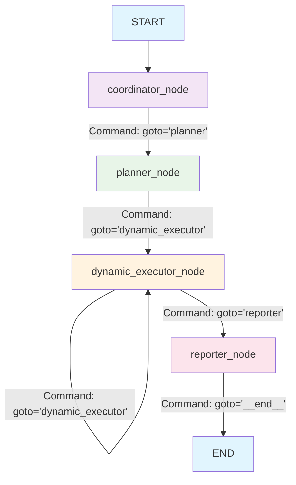
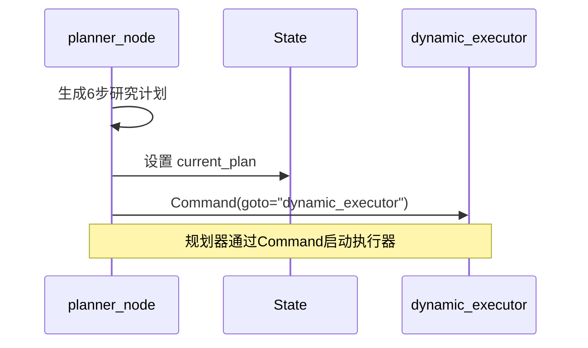
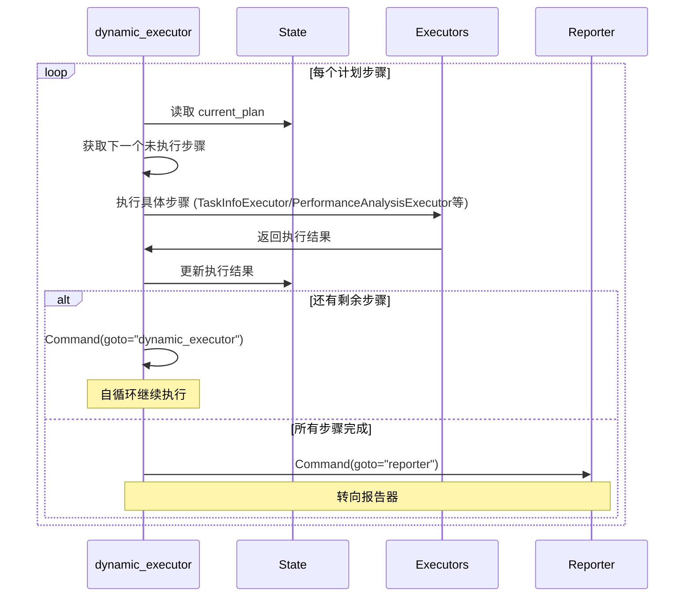
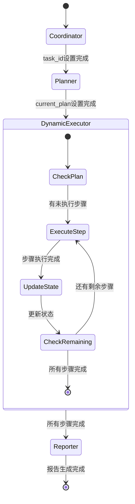

# LangGraph Command指令流可视化图表

## 🎯 指令传递总览



## 🔄 详细执行流程

### 1. 规划器指令


### 2. 动态执行器自循环


### 3. 状态流转图


## 📋 具体Command示例

### 规划器 → 动态执行器
```python
# planner_node返回的Command
Command(
    goto="dynamic_executor",
    update={
        "current_plan": {
            "title": "训练任务深度分析计划",
            "steps": [
                {"title": "获取任务信息", "type": "task_info", "completed": False},
                {"title": "性能分析", "type": "performance", "completed": False},
                # ... 更多步骤
            ]
        },
        "plan_iterations": 1,
        "observations": ["Plan generated"]
    }
)
```

### 动态执行器 → 动态执行器 (自循环)
```python
# dynamic_executor_node返回的Command (有剩余步骤)
Command(
    goto="dynamic_executor",
    update={
        "current_plan": updated_plan,  # 更新的计划 (某些步骤已标记完成)
        "observations": ["Completed: 获取任务信息"],
        "task_info_result": {"status": "running", "model": "bert"},
        "training_metrics": [...]
    }
)
```

### 动态执行器 → 报告器
```python
# dynamic_executor_node返回的Command (所有步骤完成)
Command(
    goto="reporter",
    update={
        "current_plan": completed_plan,  # 所有步骤都已完成
        "observations": ["Completed: 优化建议"],
        "optimization_result": {"recommendations": ["降低学习率", "增加batch size"]}
    }
)
```

## 🔑 核心机制总结

### Command对象的三个关键作用：

1. **流程控制** (goto字段)
   - 明确指定下一个要执行的节点
   - 支持条件跳转和循环

2. **数据传递** (update字段)
   - 在节点间传递数据
   - 累积执行结果

3. **状态同步**
   - 所有节点共享同一个State对象
   - 通过update同步最新状态

### 自动化执行的实现：

```
规划完成 ─Command─> 执行启动 ─Command(自循环)─> 逐步执行 ─Command─> 报告生成
    ↑                    ↑                        ↑              ↑
 生成计划           读取计划                  更新进度        汇总结果
```

### 容错和灵活性：

- **单步失败不中断整体流程**
- **可以跳过特定步骤**
- **支持动态计划调整**
- **可以添加新的执行器类型**

这种基于Command的指令流机制确保了从规划到执行的无缝自动化，实现了真正的"计划什么，执行什么"！